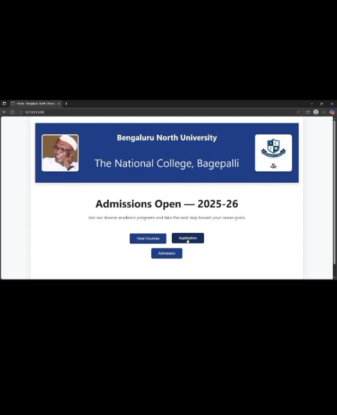
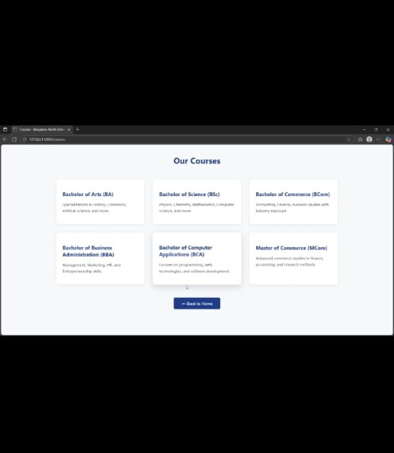
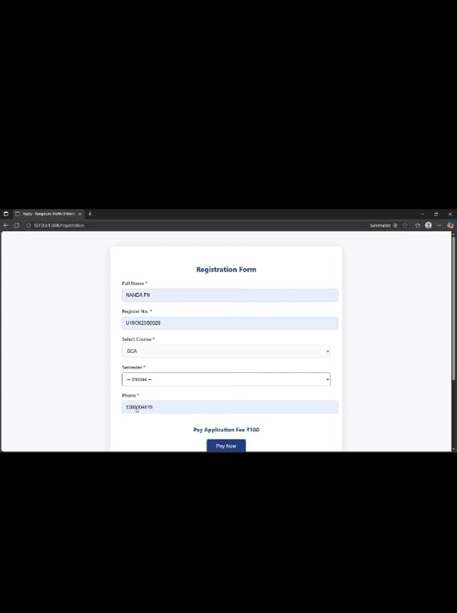
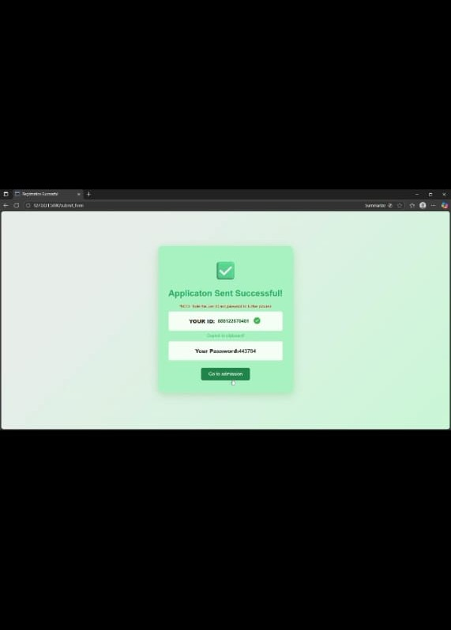
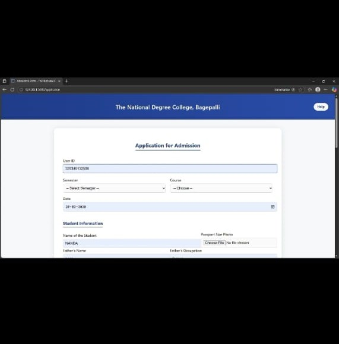
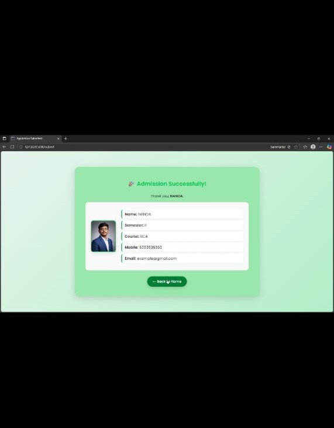

# 🎓 Student Admission & Verification System (Flask + MySQL + OCR)

This project is a complete **Student Admission Web Application** built with Flask.  
It includes:

- Student registration  
- Courses listing page  
- OCR-based fee payment extraction  
- Dynamic document & photo uploads  
- MySQL database storage  
- Student verification  
- Dynamic image display from `static/uploads/`  

Uploaded images are stored uniquely inside **`static/uploads/`** and displayed on the success page beside the student details.

---

# 🖼️ Screenshots (With Working Alternative Images)

Below, every screenshot is centered and fixed to **100×100** size.  
If your local `img/...` files are missing, you can still use the alternative placeholder links.

---

## 1️⃣ Home Page

  

This is the landing page.  
Navigation includes:

- Courses Page  
- Registration Form  
- Payment OCR Page  
- Verification Page  

---

## 2️⃣ Courses Page

  

This page lists all available courses, their codes, and titles.  
It helps students choose the correct course before filling the registration form.

Accessed through the `/courses` route.

---

## 3️⃣ Registration Page

  

Students provide:

- Personal details  
- Parent details  
- Academic info  
- Bank info  
- Upload documents (Photo, Aadhaar, Bank Proof, SSP Screenshot, Caste/Income Certificate)  

Student photo is saved into `static/uploads/`.

---

## 4️⃣ Payment Submission Page (OCR)

  

This page accepts a student's **fee payment receipt**.  
The backend uses OCR to extract:

- UTR number  
- Transaction reference ID  

The system also generates a **unique 6-digit code** for verification.

---

## 5️⃣ Admission  Page

  

  

This page shows:

- Student name (uppercase)  
- Course  
- Semester  
- Mobile  
- Email  
- **Student photo displayed dynamically from `static/uploads/`**  

The photo appears nicely aligned beside the student details.

---

7️⃣ Admission Success Form

  
 
 <em>Alternative if missing → https://via.placeholder.com/900x500?text=Admission+Success+Form+Screenshot</em> 

The Admission Success Form confirms that the student registration has been successfully completed.
It highlights the student details clearly in a modern green-themed card layout.

✔ Information Displayed

-Student Name

-Semester

-Course

-Mobile Number

-Email ID

-Uploaded Student Photograph
---

